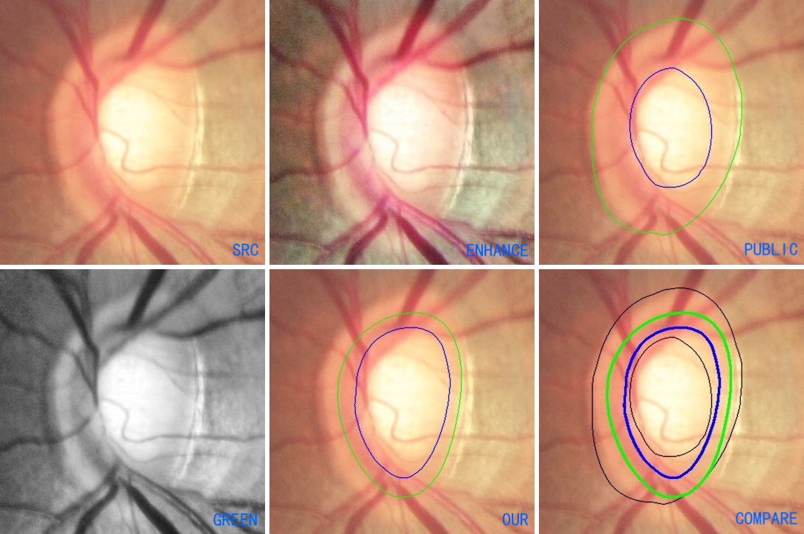

# REFUGE Dataset Personal Disc & Cup Annotations

I annotated the REFUGE dataset based on the references and my own understanding.  
Does it make sense? Looking forward to your feedback, thank you.  

------

## Annotation Comparison

### Compare the personal annotation with the public annotation

For Disc: Our regions are generally smaller than the public regions.  
For Cup: Our regions are mostly larger than the public regions.  

### Compare the personal CDR with the public CDR

------

## About REFUGE

REFUGE: Retinal Fundus Glaucoma Challenge

Orlando, J. I., Fu, H., Breda, J. B., van Keer, K., Bathula, D. R., Diaz-Pinto, A., et al. (2019). **"REFUGE Challenge: A unified framework for evaluating automated methods for glaucoma assessment from fundus photographs[J]."** Medical image analysis, 2020, 59: 101570. 
Link: https://www.sciencedirect.com/science/article/pii/S1361841519301100

REFUGE Dataset: https://refuge.grand-challenge.org  

------

## Optic Disk Characteristics

* Schematic drawing of the optic disc and parapapillary region to illustrate the definition of disc characteristics.  
* Disc area is the sum of the areas of the cup (1) and neural rim (2).  
* Zone alpha (4) and zone beta (3) represent parapapillary atrophy zones.  
* Elschnig’s parapapillary scleral ring (5) separates the parapapillary region from the disc. [8] 

### Disc

* Measure the optic disk as all area inside of the peripapillary scleral ring. The peripapillary scleral ring itself does not belong to the optic disk. [7]

* There is often, but not always, a flange of scleral tissue that terminates beyond the end of Bruch's membrane. In clinical measurements, the edge of this scleral flange is often used to mark the outer border of the disc.  [6]

* Disc margin is defined as the inner border of the Elschnig peripapillary scleral ring or the outer border of the neural rim if the Elschnig ring was not visible. [8]  

### RIM

* As the nerve fibres converge on the edge of the disc they pour over the scleral ring (which marks the edge of the disc) and then down its inner surface. This dense packing of nerve fibres just inside the scleral ring is visualised as the neuroretinal rim. [11]  

### Cup

* The cup is the area central to the neuroretinal rim. The cup edge (where it meets the neuroretinal rim) is best seen by the bend in small and medium-sized blood vessels as they descend into the cup. [11]  

------

## Annotation Tool

------

## References

1. Hitchings, R. A., and G. L. Spaeth. **"The optic disc in glaucoma. I: Classification."** British journal of ophthalmology 60.11 (1976): 778-785.  
Link: http://dx.doi.org/10.1136/bjo.60.11.778

2. Lichter, Paul R. **"Variability of expert observers in evaluating the optic disc."** Transactions of the American Ophthalmological Society 74 (1976): 532.  
Link: https://www.ncbi.nlm.nih.gov/pmc/articles/PMC1311528/

3. Jonas, Jost Bruno, Gabriele Charlotte Gusek, and G. O. Naumann. **"Optic disc, cup and neuroretinal rim size, configuration and correlations in normal eyes."** Investigative ophthalmology & visual science 29.7 (1988): 1151-1158.  
Link: https://iovs.arvojournals.org/article.aspx?articleid=2178231

4. Jonas, Jost B., Gabriele C. Gusek, and Gottfried OH Naumann. **"Optic disc morphometry in chronic primary open-angle glaucoma."** Graefe's archive for clinical and experimental ophthalmology 226.6 (1988): 522-530.  
Link: https://link.springer.com/article/10.1007/BF02169199

5. Varma, Rohit, et al. **"Variability in digital analysis of optic disc topography."** Graefe's archive for clinical and experimental ophthalmology 226.5 (1988): 435-442.  
Link: https://link.springer.com/article/10.1007/BF02170004

6. Quigley, Harry A., et al. **"The size and shape of the optic disc in normal human eyes."** Archives of ophthalmology 108.1 (1990): 51-57.  
Link: https://jamanetwork.com/journals/jamaophthalmology/article-abstract/638216

7. Jonas, Jost B., Wido M. Budde, and Songhomitra Panda-Jonas. **"Ophthalmoscopic evaluation of the optic nerve head."** Survey of ophthalmology 43.4 (1999): 293-320.  
Link: https://www.sciencedirect.com/science/article/abs/pii/S0039625798000496

8. Ramrattan, Raan S., et al. **"Determinants of optic disc characteristics in a general population: The Rotterdam Study."** Ophthalmology 106.8 (1999): 1588-1596.  
Link: https://www.sciencedirect.com/science/article/abs/pii/S0161642099904578

9. Fingeret, Murray, et al. **"Five rules to evaluate the optic disc and retinal nerve fiber layer for glaucoma."** Optometry-Journal of the American Optometric Association 76.11 (2005): 661-668.  
Link: https://www.sciencedirect.com/science/article/pii/S1529183905001521

10. Morgan, James Edwards, et al. **"Digital imaging of the optic nerve head: monoscopic and stereoscopic analysis."** British Journal of Ophthalmology 89.7 (2005): 879-884.  
Link: https://bjo.bmj.com/content/89/7/879.short

11. Bourne, Rupert RA. **"The optic nerve head in glaucoma."** Community Eye Health 19.59 (2006): 44-45.  
Link: https://www.pdf.www.cehjournal.org/article/the-optic-nerve-head-in-glaucoma-2/

12. Wido M. Budde, MD. **"Glaucoma or Myopia? Differentiating between glaucomatous and myopic optic discs."** glaucomatoday.com September/October 2006  
Link: https://glaucomatoday.com/articles/2006-sept-oct/0906_08.html

13. Elliott, Professors David B., and John G. Flanagan. **"Variations in appearance of the normal optic nerve head."** Optometry Today 48.3 (2008): 41-47.  
Link: https://www.metropolia.fi/sites/default/files/images/content/content-files/Variations_in_appearance_of_the_normal_optic_nerve_head.pdf

14. Schacknow, Paul N., and John R. Samples, eds. **The glaucoma book: a practical, evidence-based approach to patient care.** Springer Science & Business Media, 2010.  
Link: https://www.springer.com/gp/book/9780387766997

15. Samarawickrama, Chameen, et al. **"Myopia-related optic disc and retinal changes in adolescent children from Singapore."** Ophthalmology 118.10 (2011): 2050-2057.  
Link: https://www.sciencedirect.com/science/article/abs/pii/S0161642011002272

16. Hurairah H. **"The Optic Nerve Head; a review of the normal variants, disc anomalies and optic nerve disorders that may be encountered during retinal screening clinics[J]."** Diabetic Eye Journal. 2015.  
Link: https://www.eyescreening.org.uk/userFiles/File/DiabeticEyeJournal/DEJ5online2.pdf

17. Yang, Hongli, et al. **"The connective tissue components of optic nerve head cupping in monkey experimental glaucoma part 1: global change."** Investigative ophthalmology & visual science 56.13 (2015): 7661-7678.  
Link: https://iovs.arvojournals.org/article.aspx?articleid=2474980

18. **glaucoma.org**  
Link: https://www.glaucoma.org/

